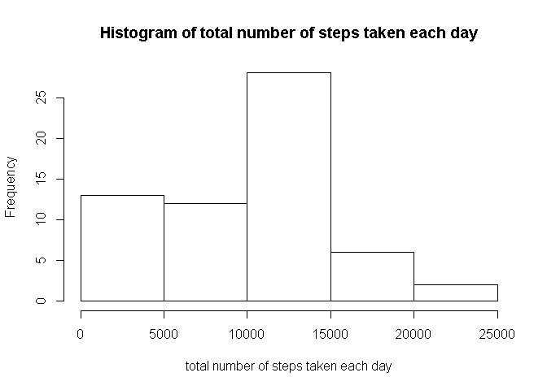
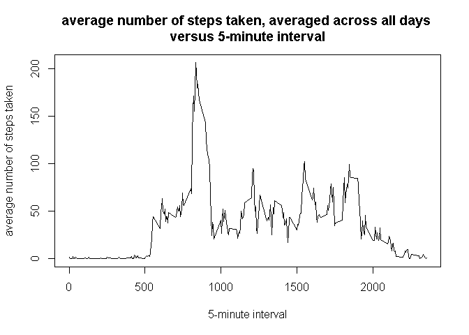
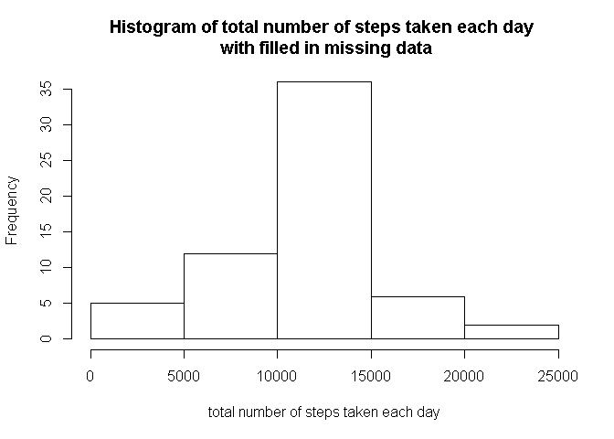
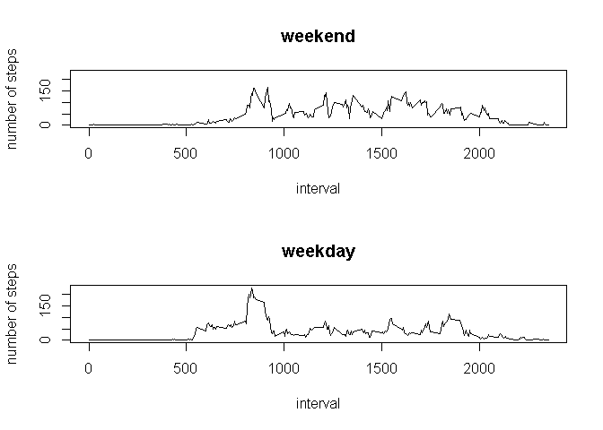

# Reproducible Research: Peer Assessment 1


## Loading and preprocessing the data

```r
# 1. Load the data (i.e. read.csv())
activityMonitoringData <- read.csv("activity.csv")
# 2. Process/transform the data (if necessary) into a format suitable for your 
#    analysis
# IM: no steps necessary 
```
## What is mean total number of steps taken per day?

```r
# For this part of the assignment, you can ignore the missing values in the 
# dataset.
# IM: this mean na.rm = TRUE

# Calculate the total number of steps taken per day
# IM: use plyr library for this calculation
library(plyr)
```

```
## Warning: package 'plyr' was built under R version 3.1.2
```

```r
totalNumberStepPerDay<- ddply(activityMonitoringData, "date",summarize,
                              tot = sum(steps, na.rm=TRUE)) 

#   If you do not understand the difference between a histogram and a barplot,
#   research the difference between them. 
# IM: The difference between a histogram and a barplot is that a histogram 
#     plots the frequency / distribution of the variable, where the barplot 
#     plots its value. 
# 1. Make a histogram of the total number of steps taken each day
hist(totalNumberStepPerDay$tot, xlab = "total number of steps taken each day", 
      main = "Histogram of total number of steps taken each day")
```

 

```r
#  2. Calculate and report the mean and median of 
#     the total number of steps taken per day
totalNumberStepPerDaymean <-mean(totalNumberStepPerDay$tot, na.rm=TRUE)
totalNumberStepPerDaymedian <-median(totalNumberStepPerDay$tot, na.rm = TRUE)
```
The mean of the total number of steps taken per day is 
9354.2295082. 
The median of the total number of steps taken per day is 
10395

## What is the average daily activity pattern?


```r
# Make a time series plot (i.e. type = "l") of the 5-minute interval (x-axis) 
# and the average number of steps taken, averaged across all days (y-axis)
totalNumberStepPerInterval<- ddply(activityMonitoringData, "interval",summarize,
                              averageStep = mean(steps, na.rm=TRUE)) 

titStr<-paste("average number of steps taken, averaged across all days",
            "\nversus 5-minute interval")
plot(totalNumberStepPerInterval$interval,totalNumberStepPerInterval$averageStep,
     type="l", xlab="5-minute interval",ylab="average number of steps taken",
     main=titStr)
```

 

```r
# Which 5-minute interval, on average across all the days in the dataset, 
# contains the maximum # number of steps?
maximumIndex<-which.max(totalNumberStepPerInterval$averageStep)
fiveMinInterval<- totalNumberStepPerInterval$interval[maximumIndex]
```
The 5-minute interval which , on average across all the days in the dataset, contains the maximum number of steps is 835

## Imputing missing values


```r
#Note that there are a number of days/intervals where there are missing values
# (coded as NA). The presence of missing days may introduce bias into some
# calculations or summaries of the data.

# 1. Calculate and report the total number of missing values in the dataset 
#    (i.e. the total number of rows with NAs)
booleanMissingValues <- is.na(activityMonitoringData$steps)
numberOfMissingValues <- sum(booleanMissingValues)
```

The total number of missing values in the dataset 2304


```r
# 2. Devise a strategy for filling in all of the missing values in the dataset. 
#   The strategy does not need to be sophisticated. For example, you could use the 
#    mean/median for # that day, or the mean for that 5-minute interval, etc.

# 3. Create a new dataset that is equal to the original dataset but with the 
#    missing data filled # in.
# IM: It seems that missing data is always one complete day, so replacing it with 
#     the mean of the day does not really help. 
#     Hence it is replaced by the mean of the 5-minute interval 
activityMonitoringDataFilledInMissingData <- ddply( 
    activityMonitoringData, "interval", 
    function(df) {df$steps[is.na(df$steps)] <- mean(df$steps, na.rm=TRUE); 
                  return(df)})
#  4. Make a histogram of the total number of steps taken each day and 
totalNumberStepPerDayWithFilledInMissingData<- ddply( 
     activityMonitoringDataFilledInMissingData, "date",summarize,
                              tot = sum(steps)) 

titStr2<- paste("Histogram of total number of steps taken each day",
                   "\n with filled in missing data")
hist(totalNumberStepPerDayWithFilledInMissingData$tot , 
     xlab ="total number of steps taken each day", main = titStr2)
```

 

```r
#  5. Calculate and report the #mean and median total number of steps 
#     taken per day.
totalNumberStepPerDaymeanWithFilledData <- 
    mean(totalNumberStepPerDayWithFilledInMissingData$tot)
totalNumberStepPerDaymedianWithFilledData <- 
    median(totalNumberStepPerDayWithFilledInMissingData$tot)

#  Do these values differ from the estimates from the first part of the 
#  assignment?

#  What is the impact of imputing missing data on the
#  estimates of the total daily number of steps?
```

The mean of the total number of steps taken per day is 
1.0766189\times 10^{4}. 
The median of the total number of steps taken per day is 
1.0766189\times 10^{4}

The estimates of the mean and median with the filled in data 
are larger than the estimates without. 


## Are there differences in activity patterns between weekdays and weekends?


```r
#
# For this part the weekdays() function may be of some help here. 
# Use the dataset with the filled -in missing values for this part.

# 1. Create a new factor variable in the dataset with 
#    two levels - "weekday" and "weekend"  indicating whether 
#    a given date is a weekday or weekend day.

activityMonitoringDataFilledInMissingData <- mutate(
    activityMonitoringDataFilledInMissingData, 
    weekDay = weekdays(as.Date(date)), 
    isWeekDay =!( grepl("Saturday",weekDay) | grepl("Sunday",weekDay) ))


# 2. Make a panel plot containing a time series plot (i.e. type = "l") 
#    of the 5-minute interval (x-axis) and the average number of steps taken, 
#    averaged across all weekday days or weekend days # (y-axis). 
#    See the README file in the GitHub repository to see an example of 
#    what this plot should look like using simulated data.
totalNumberStepPerIntervalWeekDay<- ddply( 
    activityMonitoringDataFilledInMissingData, c("interval","isWeekDay"),
                    summarize,averageStep = mean(steps)) 
 
# IM: set subplots
par(mfrow=c(2,1)) 
# IM: calculate limit for y axis
yLimAxes=c(0,max(totalNumberStepPerIntervalWeekDay$averageStep))
plot(totalNumberStepPerIntervalWeekDay$interval[ 
         !totalNumberStepPerIntervalWeekDay$isWeekDay], 
     totalNumberStepPerIntervalWeekDay$averageStep[ 
         !totalNumberStepPerIntervalWeekDay$isWeekDay], 
     type="l",xlab="interval",ylab="number of steps",main="weekend", 
     ylim=yLimAxes) 
plot(totalNumberStepPerIntervalWeekDay$interval[ 
         totalNumberStepPerIntervalWeekDay$isWeekDay], 
     totalNumberStepPerIntervalWeekDay$averageStep[ 
         totalNumberStepPerIntervalWeekDay$isWeekDay],
     type="l",xlab="interval",ylab="number of steps",main="weekday",
     ylim=yLimAxes) 
```

 

```r
# IM: restore subplots to default value     
par(mfrow=c(1,1)) 
```
